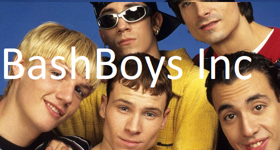

# INF112 - Group Project V2020 - RoboRally

### Participants:
- Mathias Haugsbø
- Egil Bru 
- Elias Bendixen
- Erlend Dahl
- Terje Baklund

### Requirements:
1. Java 8
2. Something to build the maven project, we have used IntelliJ Community Edition.

### How to run:
1. Open project in IntelliJ Community Edition or other editors that supports Java Maven projects.
2. Click `Run 'Main'` or key shortcut: `SHIFT + F10` in IntelliJ
3. IntelliJ will now download dependencies and build project.
4. After compiling, the game will launch

### Our target high level specifications:
- [x] Working game with RoboRally rules
- [x] LAN multiplayer
- [x] Work on all operating systems
- [x] Work on laptops with 1366x768px or larger resolution with screen size of 13" or larger.

### Development goals for assignment 1:
- [x] Display board on screen
- [x] Place game piece on the board

### Development goals for assignment 2:
- [x] Moving robot
  - [x] Robot can't move through walls
  - [x] Robot pushes other robots
- [x] Show cards on screen

### Development goals for assignment 3:
- [x] Almost playable game
  - [x] Cards move Robot 
  - [x] Robot interacts with enviroment
  - [x] Robot can die and heal
  - [x] Everthing is moves/done following the RoboRally rules
- [x] Usable Gui and buttons
  - [x] dragabble/clickable cards
  - [x] visual card selection
  
  
### Development goals for assignment 4:
- [x] Game has a main menu
  - [x] Settings
  - [x] Join and Host
  - [x] Help and Credits (Bug: Only works on Windows)
- [x] Togglable music for game
  - [x] Option in settings
- [x] Ability to host a multiplayer and LAN game
  - [x] Host menu button
  - [x] Working LAN multiplayer
  - [x] Working Online Multiplayer
- [x] Ability to join a hosted game
- [x] Player can win game by taking flags
  - [x] Flags that has to be taken i correcty order
  - [x] Player can win the game by taking all the flags
  - [x] Win screen

 
### Requirements from customer (Taken from lecture slides early in INF112 course)
- [x] Show a playing board
- [x] Show a pice
- [x] Move a pice
- [x] Play from different machines
- [x] Give out cards
- [x] Pick cards (5 of 9)
- [x] Move piece based on card
- [x] Give out cards in the beginning of a new round
- [x] Show more (at least two) pieces at the same playing board
- [x] Give out cards to each robot
- [x] Move pieces at the same time
- [x] Move pices based on priority on the programming cards
- [x] Flag on playing board
- [x] Registrate that a robot has been on a flag
- [x] Handle conflicts on movements correctly
- [x] Place backups
- [x] Respawn on backup when destroyed
- [x] Moving into a hole leads to destroyed robot, player lose life if the robot is destroyed and respawn from last backup
- [x] Moving outside of board leads to destroyed robot, lose of life and respawn on last backup
- [x] If the robot is shot 9 times, lose a life and respawn from last backup
- [x] If a robot is pointed towards another in the end of a phase, shoot laser and the receiving robot gets damage
- [x] If robot has damage, then you get less cards according to how high the damage is
- [x] Robot can not move through walls
- [x] Too much damage leads to programming cards stuck in programming sequence

### Dev mode
- piler : move
- enter : turn do
- j : remove card
- k : add card
- r : respawn
- n : remove life tokens
- m : add life tokens
