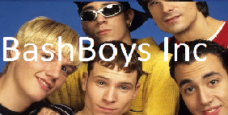

# INF112 - Group Project V2020 - RoboRally

### Participants:
- Mathias Haugsbø
- Egil Bru 
- Elias Bendixen
- Erlend Dahl
- Terje Baklund

### Our target high level specifications:
- [x] Working game with RoboRally rules
- [x] LAN multiplayer
- [x] Work on all operating systems
- [x] Work on laptops with 1366x768px or larger resolution with screen size of 13" or larger.

### Development goals for assignment 1:
- [x] Display board on screen
- [x] Place game piece on the board

### Development goals for assignment 2:
- [x] Moving robot
  - [x] Robot can't move through walls
  - [x] Robot pushes other robots
- [x] Show cards on screen

### Development goals for assignment 3:
- [x] Almost playable game
  - [x] Cards move Robot 
  - [x] Robot interacts with enviroment
  - [x] Robot can die and heal
  - [x] Everthing is moves/done following the RoboRally rules
- [x] Usable Gui and buttons
  - [x] dragabble/clickable cards
  - [x] visual card selection

### How to run:
1. Open project in IntelliJ Community Edition or other editors that supports Java Maven projects.
2. Click `Run 'Main'` or key shortcut: `SHIFT + F10` in IntelliJ
3. IntelliJ will now download dependencies and build project.
4. After compiling, the game will launch

#### Requirements:
1. Java 8
2. Something to build the maven project, we have used IntelliJ Community Edition.
